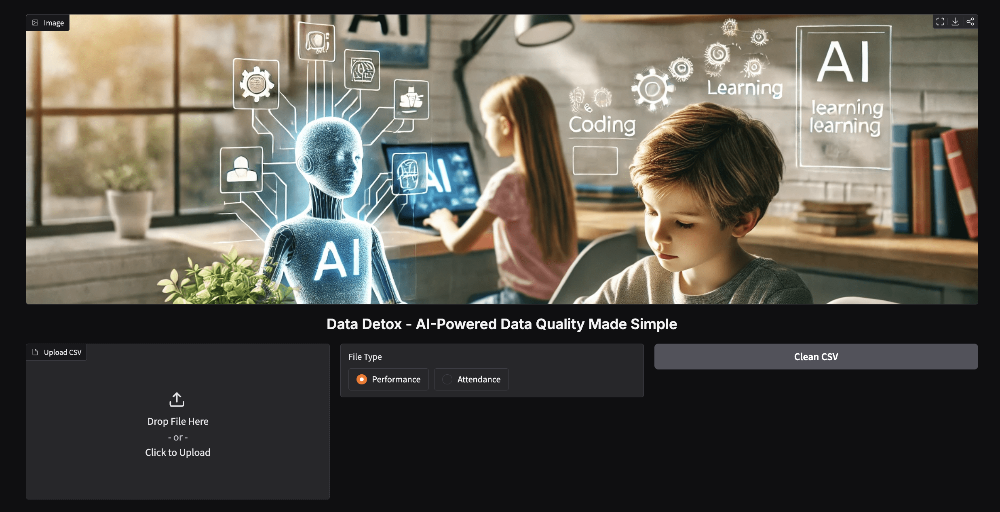
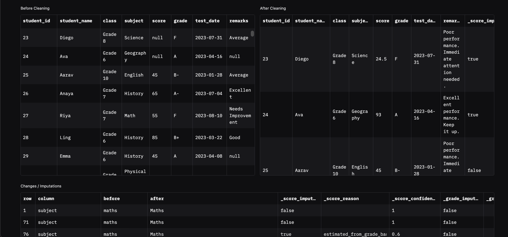

# DataDetox

**AI-powered CSV cleaning prototype for schools**  

DataDetox is a lightweight tool designed to help school administrators and data teams clean, harmonize, and manage CSV data efficiently. The system ensures transparency, tracks changes, flags rows for review, and allows version rollback — bridging the gap between raw data and actionable insights.

---

## Features

- **Automatic cleaning & harmonization**: Handle missing values, inconsistent formats, and minor errors.
- **Version control**: Track changes and maintain multiple versions for full transparency.
- **Flagging for human review**: Highlight rows that need manual attention.
- **Rollback functionality**: Revert to previous versions easily.
- **School-focused**: Tailored for student, performance, and operational CSVs.

---

## Practical Benefits

- **For school administrators**: Faster, reliable insights for decision-making.
- **For data teams**: Reduced time spent on repetitive cleanup tasks, focusing more on analytics and strategy.
- **Collaboration**: Provides a common platform for multiple stakeholders to work with trustworthy data.

---

## Getting started

### Prerequisites

- Python 3.10+
- Install dependencies:

### File structure


### Installation instructions
```bash
pip install -r requirements.txt
git clone https://github.com/<your-username>/DataDetox.git
cd DataDetox
python -m venv venv
source venv/bin/activate   # Linux/Mac
venv\Scripts\activate      # Windows
pip install -r requirements.txt
```

### User interface




```bash
pip install -r requirements.txt


